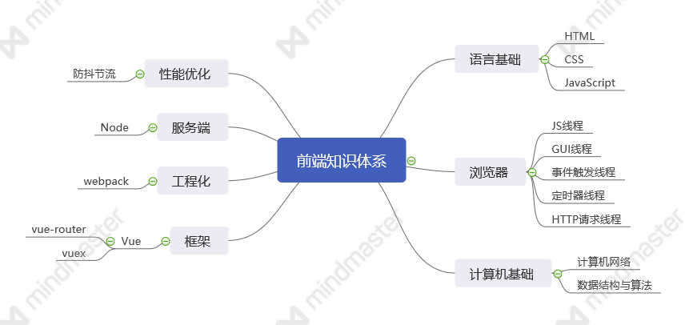

# 前端知识体系

## 前言
其实就是看到java有很多非常棒的学习github仓库，于是算是受到了启发，希望能建立起前端学习的知识库，供大家学习参考，同时也是记录自己学习历程的一个写照。上图是自己学习前端中大概会涉及到的领域，因个人精力有限，所以可能很多方面无法顾及到，期待有兴趣的小伙伴一起加入来完善这个知识库。

笔者自己就是半路出家，在学习编程语言的同时，一边慢慢去补足基础，所以整篇并不是按顺序来的，有的部分还未整理构思出来，有的因为工作原因需要学习，也放在这个前端体系中了，比如flutter，当然这个也不是移动端必须学习的，只是作为一个参考。

## 计算机基础

### 数据结构与算法

* [栈](./data-structure-and-algorithm/code/stack.js)
* [队列](./data-structure-and-algorithm/code/queue.js)
* [链表](./data-structure-and-algorithm/code/linkedList.js)
* [集合](./data-structure-and-algorithm/code/set.js)
* [字典](./data-structure-and-algorithm/md/dictionary.md)
* [哈希表(散列)](./data-structure-and-algorithm/md/hash.md)
* [树](./data-structure-and-algorithm/md/tree.md)

<small>逆波兰表达式（后缀表达式）</small>

## 语言基础
* [HTML](./language/html.md)
* [JAVASCRIPT](./language/javascript.md)

## 浏览器
[概览](./basic/browser.md)

## 移动端
暂无

## 框架

### vue
1. vue源码学习
2. [vuex源码学习](./vuex-src/readme.md)
3. vue-router源码学习

### react
暂无

## 工程化
### webpack
1. webpack源码学习

### git
暂无

## 服务端
[Node学习](./nodejs/nodejs.md)

## 性能优化
暂无
