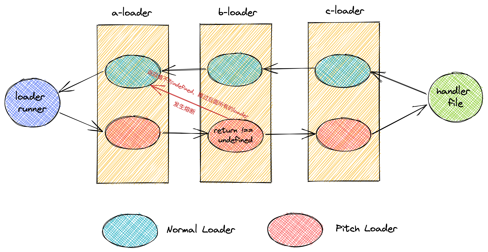

# 工程化

## 模块化

### CommonJS

Nodejs 中使用 CommonJS 规范，规定了一个文件就是一个模块，模块可以多次加载，但是只会在第一次加载时运行一次，会将运行以后的结果进行**缓存**，以后加载只会去读取缓存。要想模块再次运行，需要清除缓存。

另外需要注意的点则是 CommonJS 模块导出的值是一个**拷贝**，可以把这个拷贝当作是函数中的传参，对于基本类型，会复制出来一个值，而对于引用类型，则拷贝的是值的引用。因此对于 CommonJS 导出的值，如果是基础值，模块内部改变了改基础值，也不会影响到模块外面，但如果是引用类型，模块内部的修改是会影响到外部的。

最后的关注点则是 CommonJS 模块是**同步加载**的，需要等到前面的模块加载完毕以后，才会加载后面的模块。

### AMD

使用`define`定义模块，使用`require`来加载模块，遵循此规范的代表：`require.js`。

AMD 用于浏览器环境，模块可以进行非同步加载，也可以根据需要**动态加载**。

### CMD

CMD 规范整合了 CommonJS 和 AMD 规范，用于浏览器端。模块是异步加载的，使用的时候才会去加载。遵循此规范的代表：`Sea.js`。

CMD 和 AMD 的定义模块、加载模块的方法有所不同。

### ES Module

ES Module 是浏览器端的模块化规范，也是未来的浏览器的模块标准。ES Module 是**静态化**的，是在**编译**时就能确定模块的依赖关系，所以可以用来做静态分析，判断哪些模块没有使用，通过 tree shaking 来去掉这些 dead code。

ES Module 和 CommonJS 最重要的区别就是 ES Module 导出的是值的引用，而 CommonJS 则是值的拷贝。这里引用的意思就是无论导出的值是什么类型，模块内部修改都会影响到模块外部。另外 ES Module 是编译时输出，而 CommonJS 则是运行时加载。

## Babel

[图片来源](https://bobi.ink/2019/10/01/babel/)

## Webpack

[图片参考](https://developer.aliyun.com/article/61047#slide-3)

### 一些重要的概念

> Module 模块，即每个单独的文件代表一个模块

> Chunk Webpack 打包过程中，会把 Module 合并生成 Chunk，多个 Chunk 会形成 Chunk 组。Chunk 有两种。一种是 initial，表示入口文件及其依赖形成的 Chunk。另外一种是 non-initial，表示延迟加载的 Chunk。每个 Chunk 都有对应的 Assets

> Assets 表示输出文件，即打包结果

> Bundle 由多个 Chunk 组成，表示最终可以运行在浏览器中的代码

[概念来源](https://webpack.docschina.org/concepts/under-the-hood/)

### Loaders

loader 的分类:

1. pre loader
2. post loader
3. inline loader
4. normal loader
5. pitch loader

loader 执行分为两个阶段:

- Pitch 阶段，执行 loader 上的 pitch 方法，按照 post、inline、normal以及 pre 的顺序调用。
- Normal 阶段，loader 上的常规方法，按照 pre、normal、inline以及 post 的顺序调用。

关于 loader 如何使用，参照[文档](https://webpack.docschina.org/configuration/module/#ruleenforce)

[图片来源](https://www.teqng.com/2021/08/11/%E5%A4%9A%E5%9B%BE%E8%AF%A6%E8%A7%A3%EF%BC%8C%E4%B8%80%E6%AC%A1%E6%80%A7%E6%90%9E%E6%87%82webpack-loader/)

### Plugins

> **compiler 对象代表了完整的 webpack 环境配置。这个对象在启动 webpack 时被一次性建立，并配置好所有可操作的设置，包括 options，loader 和 plugin。当在 webpack 环境中应用一个插件时，插件将收到此 compiler 对象的引用。可以使用它来访问 webpack 的主环境。**

> **compilation 对象代表了一次资源版本构建。当运行 webpack 开发环境中间件时，每当检测到一个文件变化，就会创建一个新的 compilation，从而生成一组新的编译资源。一个 compilation 对象表现了当前的模块资源、编译生成资源、变化的文件、以及被跟踪依赖的状态信息。compilation 对象也提供了很多关键时机的回调，以供插件做自定义处理时选择使用。**

[摘自文档](https://www.webpackjs.com/contribute/writing-a-plugin/)
