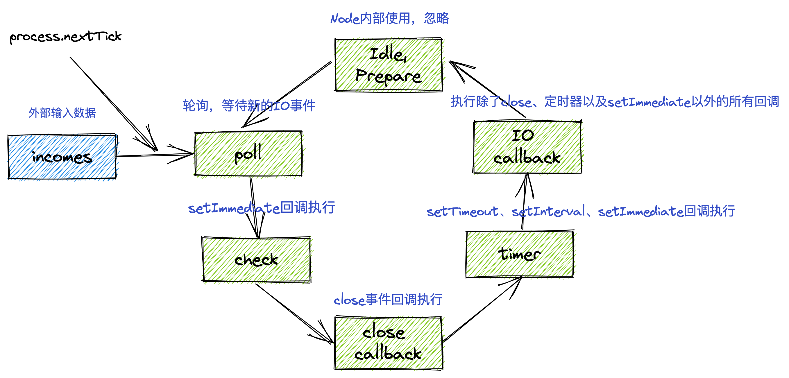

# 面试问题记录

## 前端基础

### 什么是BFC，如何利用BFC实现两栏布局，第一栏不定宽高，第二栏占据剩余空间

BFC全称**块级格式化上下文**，就是一块拥有独特的渲染规则的区域，区域内的元素不会影响到区域外的元素。利用BFC可以实现一些特定的功能：

- 清除浮动，防止浮动元素导致父元素高度塌陷
- 避免外边距折叠，BFC内的元素垂直方向上会发生折叠，但是两个不同的BFC元素则不会发生折叠
- 防止元素被浮动元素覆盖。

实现BFC主要有以下几种属性：

- body 根元素
- 浮动元素：float 除 none 以外的值
- 绝对定位元素：position (absolute、fixed)
- display 为 inline-block、table-cells、flex
- overflow 除了 visible 以外的值 (hidden、auto、scroll)

利用BFC就很容易实现两栏布局：

```html
<div class="container">
    <div class="child1"></div>
    <div class="child2"></div>
</div>
```

```css
.container {
    overflow: hidden;
}
.child1 {
    border: 1px solid red;
    float: left;
}
.child2 {
    border: 1px solid blue;
    height: 100px;
    overflow: hidden;
}
```

### flex布局中flex-grow和flex-shrink的计算规则

flex-grow属性是容器比子元素大的时候，子元素如何分配多出来的空间的规则，一般是按照下面这个式子来计算：

子元素的宽度 = 子元素设置的宽度 + 容器剩余宽度 * flex-grow / 所有子元素总共的flex-grow的值

假设容器宽度为500，两个子元素的宽度分别为200，200，其flex-grow的值为2,3，那么按照上面的公式可以得到：

第一个子元素的宽度 = 200 + （500 - 400）* （2 / 5）= 240
第二个子元素的宽度 = 200 + （500 - 400）* （3 / 5）= 260

flex-shrink则是当子元素宽度之和超过容器元素，则每个子元素按照其设置的值进行缩放，缩放规则和flex-grow是完全不一样的：

总权重 = 每一项的子元素(flex-basis * flex-shrink) + (flex-basis * flex-shrink) + ....

这里flex-basis默认值为auto，也就是子元素本来的宽度

子元素自身的权重 = (自身宽度 * flex-shrink) / 总权重

子元素缩小的宽度 = 溢出的宽度 * 自身的权重

还是按照上面的例子来，不过此时是flex-shrink的属性值分别为2和3，宽度分别为300，300，按照上面的公式计算可以得到：

总权重 = 300 * 2 + 300 * 3 = 1500
第一个子元素的权重 = 300 * 2 / 1500 = 2 / 5
第二个子元素的权重 = 300 * 3 / 1500 = 3 / 5
第一个子元素缩小的宽度 = （600 - 500）* 2 / 5 = 40
第二个子元素缩小的宽度 = （600 - 500）* 3 / 5 = 60
第一个子元素缩小后的宽度 = 300 - 40 = 260
第二个子元素缩小后的宽度 = 300 - 60 = 240

### 如何使元素position:fixed基于父元素进行定位

`position: fixed`一般使基于`viewport`进行定位，如果要改变的话，可以在父元素上添加`transform: scale(1)`或者其他任何不为`none`的属性，都可以使其相对于父元素进行定位。

原理就是`transform: scale(1)`非`none`的值会创建层叠上下文，层叠上下文会影响子级元素的定位，等于重新创建了一个新的图层。

兼容性问题，谷歌浏览器和firefox下除了`transform`属性，`perspective`属性也可以使`fixed`布局失效，但是在safari和IE以及Edge下，都是无法使`fixed`失效的。
### promise数组如何串行执行

所谓串行执行，其实就是按顺序执行，这里按顺序执行，假设promise数组中不存在下一个执行依赖上一个执行的情况，考虑使用reduce来实现

```js
const arr = [
    new Promise(resolve => {
        console.log(1);
        resolve();
    }),
    new Promise(resolve => {
        console.log(2);
        resolve();
    }),
    new Promise(resolve => {
        console.log(3);
        resolve();
    })
];

function sequeceExcution(arr) {
    arr.reduce((prev, cur) => prev.then(val => cur)}, Promise.resolve());
}

sequeceExcution(arr);
```

这样执行的结果为1, 2, 3，这么做是否是顺序执行了呢，可以使用定时器来看看。假设每个promise中都有一个定时器，第一个定时器3s以后执行，第二个2s以后执行，第三个1s，那么可以这么写：

```js
const createPromise = (time, id) => new Promise(resolve => {
    setTimeout(() => {
      console.log("promise", id);
      resolve();
    }, time);
});

sequeceExcution([
    createPromise(3000, 1),
    createPromise(2000, 2),
    createPromise(1000, 3)
]);

```

最后可以得到3s以后打印出1，然后2s后打印2,1s以后打印出3，确实按照我们设置的顺序执行了。

除此之外，也可以使用递归来做:

```js
function dispatch(i, p = Promise.resolve()) {
  if (!arr[i]) return Promise.resolve();
  return p.then(() => dispatch(i + 1, arr[i]));
}

dispatch(0);
```

其他的还有利用async、await的方法，或者是利用for-of、for-await-of循环等比较普遍的写法，这里就不一一展开了。

## 除了 setTimeout 和 setInterval 以外还有没有其他方式实现轮询

可以利用 requestAnimationFrame 来实现轮询

```js
let start = 0;
function poll (timestamp) {
    if (timestamp - start >= 3000) {
        start = timestamp;
    }
    requestAnimationFrame(poll);
}
```


## 框架

### React 的 setState是同步还是异步

**在生命周期方法或是合成事件中 setState 是异步的**。原因是此阶段 React 并不会立刻执行更新，而是将更新放入一个队列中，给人感觉好像是异步的。当顶层组件 didMount 以后才会开始更新。需要注意在 componentDidMount 中 调用 setState 会触发两次 render 方法。而在 componentWillUpdate、componentDidUpdate中调用则会导致死循环。

**在异步方法和原生事件中 setState 是同步的**。此时 React 已经执行队列中的异步方法，说明已经是在更新过程中了，这个时候调用 setState 会立刻得到更新后的状态

[来源](https://juejin.cn/post/6844903781813993486#heading-10)

## 网络

### 简单请求和非简单请求

简单请求就是使用设定的请求方式请求数据，比如GET、POST、HEAD，这些可以直接用 form表单发送请求。

而非简单请求则是在使用设定的请求方式请求数据之前,先发送一个OPTIONS请求,看服务端是否允许客户端发送非简单请求.只有"预检"通过后才会再发送一次请求用于数据传输。非简单请求如PUT。

除了以上这些区别外，还可以通过请求头来区分简单请求和非简单请求

请求头信息不超过以下几个字段：Accept、Accept-Language、Content-Language、Last-Event-ID，Content-Type 对应的值是以下三个中的任意一个 application/x-www-form-urlencoded、multipart/form-data、text/plain。只有满足这些**请求头**以及请求**方法**，GET、POST、HEAD的请求才是简单请求，除此之外都是非简单请求。

### 设置什么响应头可以触发浏览器下载文件

通过设置 Content-Type 和 Content-Disposition 字段即可触发浏览器下载资源

```javascript
// nodejs中
fs.readFile('./req_get_download.js', function (err, data) {
    const header = {
        'Content-Type': 'application/octet-stream',
        'Content-Disposition': 'attachment;filename=req_get_download.js'
    };
    res.writeHead(200, header);
    res.end(data);
});
```

### 请求头字段Refer的意思

Refer就是告诉服务器该网页是从哪个页面链接过来的，服务器因此可以获得一些信息用于处理

作用：
1. 防盗链
2. 防止恶意请求
3. 空Refer，当一个请求并不是由链接触发产生的，那么自然也就不需要指定这个请求的链接来源

### http1.x和http2.0的对比

1. 完全兼容1.x的方法。
2. 二进制分帧
3. 多路复用
4. 头部压缩
5. 请求优先级
6. 服务端推送

[来源](https://juejin.cn/post/6844903984524705800)

# React

## React 生命周期


## React Fiber

1. 把原有的递归更新架构改为可中断更新
2. DOM节点抽象成普通对象，称之为Vituial DOM，React中也可以叫做fiber
3. fiber就是一个时间切片，并且提供了任务优先级的调度

现在的架构分为三层
- Scheduler调度器，负责任务优先级的调度
- Reconciler协调器，找出fiber中变化的部分
- Renderer渲染器，将变化的部分渲染到页面上

> [React技术揭秘](https://react.iamkasong.com/preparation/newConstructure.html#react16%E6%9E%B6%E6%9E%84)

## Hooks原理


## diff算法

React 中的 diff 算法实际就是两颗树的diff，current 指针，指向了页面中的树，workInProgress 则指向了内存中更新的树。两颗树进行对比，需要`O^3`的时间复杂度，为了降低这个复杂度，React 做了一些进行 diff 的前置条件。

1. 只对同级的节点进行 diff，如果跨级的话，React 并不会复用节点
2. 不同类型的元素不会复用，只会销毁原来的元素及其子节点，新建新的节点
3. 可以通过 key 属性来暗示哪些元素是可以复用的。

同样根据更新后的节点的类型，diff 主要分为两种类型：

1. 单节点diff

单节点就是更新以后只有一个节点的情况，也会有以下几种情况

- 更新后的节点的类型和旧节点的类型不同，无法复用，删除旧节点，新建更新后的节点
- 更新后的节点类型和旧节点类型相同，key不同，无法复用，删除旧节点，新建新节点
- 更新后的节点类型和key都和旧节点相同，复用旧节点。旧节点如果还有剩余节点，则删除剩余节点及其子节点


2. 多节点diff

- 节点更新前后，数量相等，可能节点类型、属性发生变化
- 更新后的节点数量比更新前少，说明节点进行了删除
- 更新后的节点数量比更新前多，说明新增了节点
- 节点前后数量一致，类型属性一致，顺序发生了变化，这也是 diff 算法的核心

经过两轮遍历，第一轮找到更新的节点，第二轮则处理不是更新的节点，如位置、新增或者是删除。这里假设子节点有abcd四个节点，字母代表其 key 值，更新后的节点位置为dabc，根据参考位置索引 lastPlacedIndex 以及 新节点在旧节点的索引来决定是否需要移动。


[参考链接](https://react.iamkasong.com/diff/prepare.html)
## 性能优化

1. 优化加载性能

- 根元素添加 loading，使用prerender-spa-plugin，都是为了减少白屏时间
- 利用缓存、动态polyfill、代码分割、tree-shaking
- 看需要是否需要把代码编译到ES5，不需要的话，直接使用ES6+的代码，减少编译时间和代码体积
- 使用懒加载和骨架屏

# JS基础

## 原型

> 每一个 JavaScript 对象（null除外）在创建的时候就会与之关联另外一个对象，这个对象就是所说的原型。每一个对象都会从原型继承属性

关于原型需要知道的三个属性

- `constructor`
- `__proto__`
- `prototype`

```javascript
function Person() {}
const person = new Person()

// 实例的原型指向了构造函数的原型
console.log(person.__proto__ === Person.prototype);
// 构造函数原型的constructor属性指向了构造函数本身
console.log(Person.prototype.constructor === Person);
// 实例对象的constructor属性指向了构造函数本身
console.log(person.constructor === Person);

```

[来源](https://github.com/mqyqingfeng/Blog/issues/2)

### 原型链

对象中的关联关系组成的链式结构就是**原型链**


## 继承的几种方法

### 原型链继承

```javascript
function SuperType() {
  this.name = 'qiugu';
}
function SubType() {}
SubType.prototype = new SuperType();

let instance = new SubType();
// 现在 SubType 生成的对象的`constructor`属性不再指向`SubType`，而是指向了`SuperType`
// 证明了上面所说的，在 JavaScript 中并没有构造一说，`constructor`也并不是构造函数，他只不过是原型上的/// 一个可以被改变的属性而已
console.log(instance.constructor === SuperType); // true
console.log(instance instanceof SubType); // true
console.log(instance instanceof SuperType); // true
console.log(instance instanceof Object); // true
```

原型链继承还是有上文原型模式同样的缺点，一旦在原型上定义了引用类型的属性，那么修改这个属性，会影响到所有继承自这个类的对象，另外则是如果不小心改变了原型的指向，那么上面所有的继承关系都会被断开。

原型链继承还有一个问题则是在不影响其他对象的情况下，无法给父函数传递参数，这个也导致原型链继承使用的很少的原因，下面的继承方法正是为了解决这个不足的。

### 构造函数继承

```javascript
function SuperType() {
  this.name = 'qiugu';
}
function SubType() {
  SuperType.call(this);
}
```

构造函数也有方法无法复用的缺点，因此一般不会单独使用，结合上面的原型链继承，就有了下面的组合继承的方法。

### 组合继承

```javascript
function SuperType() {
  this.name = 'qiugu';
}
function SubType() {
  SuperType.call(this);
}
SubType.prototype = new SuperType();
// 修正原型的constructor属性
SubType.prototype.constructor = SubType;
```

下面几种继承的方法，没有使用构造函数来实现继承，而是将继承的逻辑封装在一个普通方法中，在方法中传入对象，返回一个新对象来实现的继承。

### 原型式继承

```javascript
function object(o) {
  function F() {}
  F.prototype = o;
  return new F();
}
let person = object(new Person());
```

### 寄生式继承

```javascript
function createAnother(origin) {
  const obj = object(origin);
  obj.say = function() {
    console.log('hello');
  };
  return obj;
}
```

寄生式继承的缺点很明显，就是给对象定义方法时，每个方法都是单独的引用，无法做到方法共用，因此效率会比较低。

### 寄生组合式继承

```javascript
function SuperType() {
  this.name = 'qiugu';
}
function SubType() {
  SuperType.call(this);
}
SubType.prototype = new SuperType();
// 修正原型的constructor属性
SubType.prototype.constructor = SubType;

function parasitic(subType, superType) {
  const proto = object(superType.prototype);
  proto.constructor = subType;
  subType.prototype = proto;
}
```

寄生组合式继承是对于上面常用的组合继承方法的增强，因为组合继承实际上会执行两次父类构造方法，一次是在子类中的调用，另外一次是在改变子类的原型指向的父类实例。两次调用肯定是没有必要的，寄生组合式继承利用原型式继承，将父类的原型传递给 object 方法，返回了一个原型指向父类原型的对象，而不是父类的实例，再将子类的原型指向刚刚返回的对象，这样就只需要实例化一次父类就可以将原型对象指向了父类的原型，同时子类构造函数中调用父类构造函数初始化，这样子类上面就有自己的属性方法，而不是存在于父类上，就解决了原型共享的问题。

## 执行上下文


## 作用域

> 作用域是指程序源代码中定义变量的区域。
> 作用域，就是一套规则，用于确定在何处以及如何查找变量
> 作用域规定了如何查找变量，也就是确定当前执行代码对变量的访问权限

JS采用了词法作用域，也就是静态作用域。一般说作用域，指的就是函数作用域，在JavaScript中最重要的也就是函数了。函数的作用域在函数创建时就已经确定了，而不是在执行时确定的作用域。

```javascript
var value = 1;

function foo() {
  console.log(value);
}

function bar() {
  var value = 2;
  foo();
}

bar(); // 结果是1，原因就是foo的作用域创建时就决定了其value是1
```

### 作用域链

> 由多个执行上下文的变量对象构成的链表就是作用域链

## 闭包

> 闭包是基于词法作用域书写代码时产生的自然结果，当函数可以记住并访问所在词法作用域时，就产生了闭包，即使函数是在当前词法作用域之外执行。
> 有权访问另一个函数作用域中的变量的函数

1. 闭包只会保存包含作用域中的任何变量的最后一个值。例如在 for 循环中使用 setTimeout 访问 i

```javascript
for (var i = 0; i < 10; i++) {
  setTimeout(() => { console.log(i) }, i * 1000)
}
```

此时只能访问 i 的最后一次赋值，也就是10，因此会每次打印出10，要解决这个问题，利用闭包在最外层套上一个立即执行函数，将外部的 i 传递给里面的匿名函数，这样的话，匿名函数和外面包含的立即执行函数形成闭包，引用当前循环的 i 值

1. 在闭包中访问 this 时会有一些意想不到的结果。这是因为内部函数执行时，会生成两个对象，this 和 argements，引擎搜索这两个变量时，只会搜索到该函数的活动对象，而不会去上层的作用域中搜索，所以此时的 this 指的实际是全局变量 window。
2. 利用闭包设计模块模式

```javascript
var myModules = (function(){
  var modules = {}

  function define (name, deps, callback) {
    for (let i = 0; i < deps.length; i++) {
      // 将依赖模块的字符串重新赋值为对应的模块
      deps[i] = modules[deps[i]]
    }
    modules[name] = callback.apply(callback, deps)
  }

  function get(name) {
    return modules[name]
  }

  return {
    define,
    get
  }
})()

myModules.define('a', [], function () {
  function hello (who) {
    return `Let me introduce ${who}`
  }

  return { hello }
})

myModules.define('b', ['a'], function (a) {
  var hungry = 'hippo'

  function awesome () {
    console.log(a.hello(hungry).toUpperCase())
  }

  return { awesome }
})

var foo = myModules.get('a')
var bar = myModules.get('b')
console.log(foo.hello('hippo')) // Let me introduce hippo
bar.awesome() // LET ME INTRODUCE HIPPO
```

## 变量提升

JavaScript 在解释执行代码前会先进行预编译，把所有`var`声明的变量以及`function`声明的函数提到代码的最前面。其实就是在生成 AST 的时候，生成了执行上下文，其中包含了声明的变量，只是此时代码还未执行，所以变量都是未赋值的，当然函数声明已经是存在了。


## this指向

**this 是和执行上下文绑定的**，而执行上下文有以下三种：

- 全局执行上下文
- 函数执行上下文
- eval执行上下文（基本不使用，忽略）

全局执行上下文中的 this 指向的就是 window。而函数执行上下文中的 this 存在以下几种情况：

1. 直接调用时 this 指向了全局的 window
2. 作为对象的方法调用时，方法内部的 this 指向了对象
3. 使用 call/apply 时，this 指向了方法的第一个参数指向的上下文
4. 方法作为构造函数调用时，构造函数中的 this 会指向新对象。如果构造函数返回了一个对象，this 还是会指向构造函数默认的对象

```js
function Foo() {
  this.name = 'a';
  this.age = 20;
  console.log(this); // Foo {}，也就是去掉return语句时new出来的对象
  return {
    x: 1
  };
}
var f = new Foo(); // {x:1}
```

使用 this 时需要注意的几点：

- this 的指向不会像作用域链一样继承，换句话说就是嵌套函数中的 this 指向取决于该函数是如何调用的，如果是直接调用，那么其 this 指向了 window
- this 在严格模式下指向了 undefined 而不是 window
- 箭头函数没有执行上下文，所以不存在 this，箭头函数中的 this 就是其外部函数

[从另外一个角度看this](https://github.com/mqyqingfeng/Blog/issues/7)

## JavaScript 的内存模型


JavaScript 在运行过程中的数据存储如上图所示。一般对象都是存储在堆中，基本数据类型都是存储在栈中。

为什么要用堆来存储对象类型呢？主要是对象类型比较大，存储耗费内存，并且在 JavaScript 中使用堆栈指针来进行**上下文的切换**，如果在栈中保存对象类型，会导致切换上下文时花费的时间更长，效率也会更低。

闭包在内存模型中的结构也如上图所示。当执行到 bar 函数时，引擎扫描后发现 bar 函数引用了外部变量，则会把整个 foo 的上下文存入 closure 闭包中，这样即使 foo 已经执行完毕，bar 也依然能够访问到 foo 中的变量。

## v8的垃圾回收机制


分为栈空间和堆空间的垃圾回收

1. 栈空间的垃圾回收主要通过ESP（执行栈指针）下移回收栈顶资源。
2. 堆空间则是采用分代收集算法，分为新生代和老生代空间。老生代存放长时间存活对象，新生代存放短时间的对象。老生代采用主垃圾回收器，进行标记所有未使用对象，然后进行清除。清除过后产生**内存碎片**，需要进行整理，因此采用**标记-整理**算法。新生代采用Scavenge算法，分为两个空间，一个空间存放活动对象，另外一个空间作为备用。当主线程进行垃圾回收的时候，会把对象空间中还继续使用的对象复制到空闲区域，其他对象空间中未引用的对象进行清除，然后把空闲区域作为新的对象区域，把原来的对象区域作为新的空间区域。
3. 新生代空间中的对象经历过两次垃圾回收依然存活，则会被移动到老生代中，称为**对象晋升**

垃圾回收会导致JavaScript线程停止执行，转而去执行垃圾回收器，因此会产生**全停顿**。为了解决这个问题，又提出了**增量标记**，将一次标记变为几次标记，在浏览器执行任务中不断插入执行。

## 事件循环机制

浏览器端的事件循环


Nodejs中的事件循环



[Nodejs事件循环官方解释](https://nodejs.org/zh-cn/docs/guides/event-loop-timers-and-nexttick/)

## promise原理

1. Promise 中为什么要引入微任务？

Promise 通过 then 来收集回调方法，当在 Promise 的构造函数中调用 resolve 的时候，才会去执行 then 中注册的回调方法。如果在构造函数中采用同步方式，等到异步任务完成以后调用 then，会阻塞线程执行。而如果把 then 回调放到宏任务队列中，如果任务队列执行时间过长，导致 then 中的任务得不到执行，依然会产生阻塞。为了解决这个问题，也是为了**延迟绑定**的需求，引入了新的微任务队列。

2. Promise 中是如何实现回调函数返回值穿透？

Promise 将 resolve 的值保存在实例属性中，then 中注册的回调会引用到这个实例的属性，并且会返回一个包装注册回调方法的Promise对象。此时又分为三种情况：

第一种，then 中不传回调方法，Promise 会设置一个默认的回调方法`v => v`，此时会把实例中绑定的值传给这个磨人方法，实现了空参值穿透。
第二种，then 中的回调方法没有返回值，此时包装的回调方法中等于`resolve(undefined)`，因此后面注册的回调再去执行时，拿到的值就是 undefined
第三种则是 then 中的回调有返回值，Promise 会对返回值进行解析，判断

3. Promise 出错后，是怎么通过“冒泡”传递给最后那个捕获异常的函数？

promise源码实现可点击[这里](https://qiugu.github.io/Frontend-learning-route/#/api?id=promisea%e7%9a%84%e5%ae%9e%e7%8e%b0)


