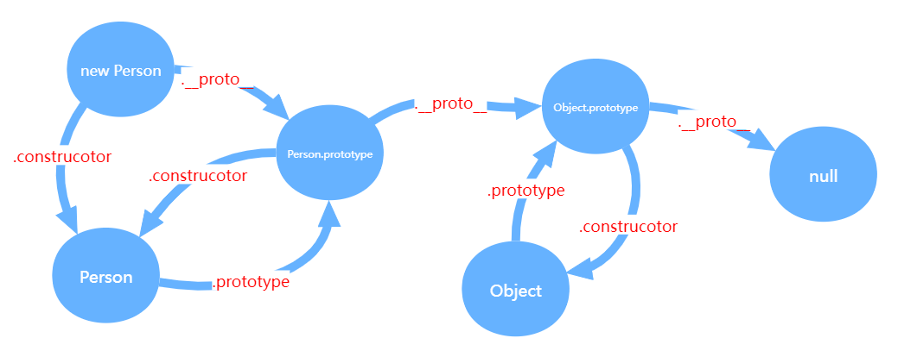
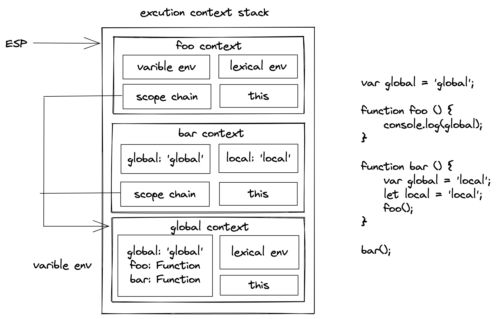
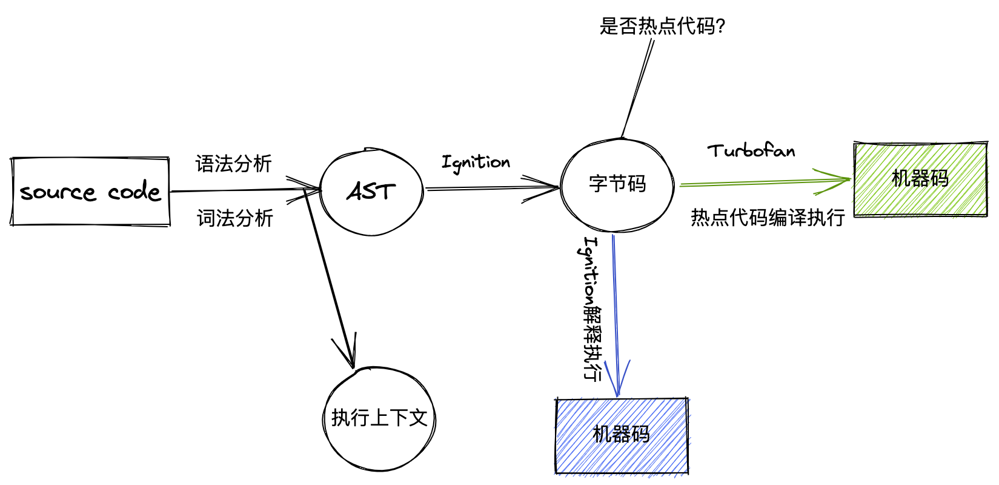
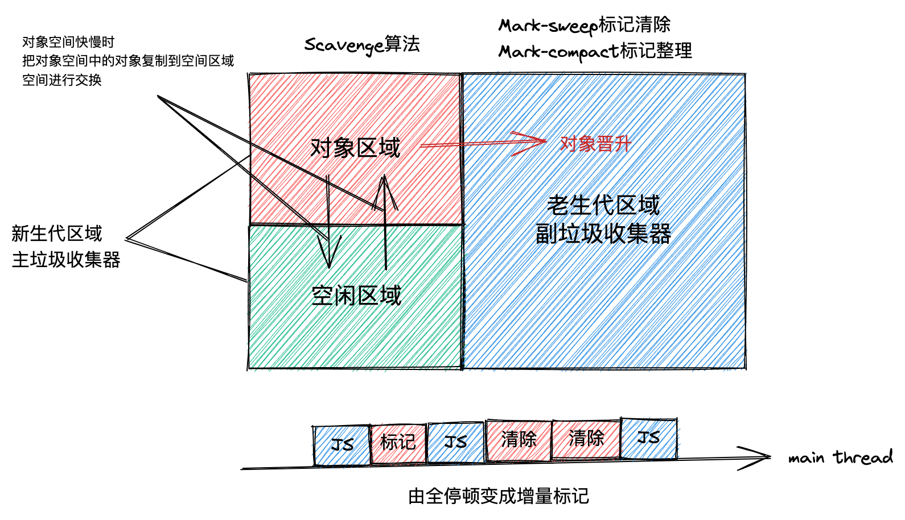

# JS基础

## 原型

> 每一个 JavaScript 对象（null除外）在创建的时候就会与之关联另外一个对象，这个对象就是所说的原型。每一个对象都会从原型继承属性

关于原型需要知道的三个属性

- `constructor`
- `__proto__`
- `prototype`

```javascript
function Person() {}
const person = new Person()

console.log(Person.prototype === Person.prototype);
// 实例的原型指向了构造函数的原型
console.log(person.__proto__ === Person.prototype);
// 构造函数原型的constructor属性指向了构造函数本身
console.log(Person.prototype.constructor === Person);
// 实例对象的constructor属性指向了构造函数本身
console.log(person.constructor === Person);

```

[来源](https://github.com/mqyqingfeng/Blog/issues/2)

### 原型链

对象中的关联关系组成的链式结构就是**原型链**



## 继承的几种方法

### 原型链继承

```javascript
function SuperType() {
  this.name = 'qiugu';
}
function SubType() {}
SubType.prototype = new SuperType();

let instance = new SubType();
// 现在 SubType 生成的对象的`constructor`属性不再指向`SubType`，而是指向了`SuperType`
// 证明了上面所说的，在 JavaScript 中并没有构造一说，`constructor`也并不是构造函数，他只不过是原型上的/// 一个可以被改变的属性而已
console.log(instance.constructor === SuperType); // true
console.log(instance instanceof SubType); // true
console.log(instance instanceof SuperType); // true
console.log(instance instanceof Object); // true
```

原型链继承还是有上文原型模式同样的缺点，一旦在原型上定义了引用类型的属性，那么修改这个属性，会影响到所有继承自这个类的对象，另外则是如果不小心改变了原型的指向，那么上面所有的继承关系都会被断开。

原型链继承还有一个问题则是在不影响其他对象的情况下，无法给父函数传递参数，这个也导致原型链继承使用的很少的原因，下面的继承方法正是为了解决这个不足的。

### 构造函数继承

```javascript
function SuperType() {
  this.name = 'qiugu';
}
function SubType() {
  SuperType.call(this);
}
```

构造函数也有方法无法复用的缺点，因此一般不会单独使用，结合上面的原型链继承，就有了下面的组合继承的方法。

### 组合继承

```javascript
function SuperType() {
  this.name = 'qiugu';
}
function SubType() {
  SuperType.call(this);
}
SubType.prototype = new SuperType();
// 修正原型的constructor属性
SubType.prototype.constructor = SubType;
```

下面几种继承的方法，没有使用构造函数来实现继承，而是将继承的逻辑封装在一个普通方法中，在方法中传入对象，返回一个新对象来实现的继承。

### 原型式继承

```javascript
function object(o) {
  function F() {}
  F.prototype = o;
  return new F();
}
let person = object(new Person());
```

### 寄生式继承

```javascript
function createAnother(origin) {
  const obj = object(origin);
  obj.say = function() {
    console.log('hello');
  };
  return obj;
}
```

寄生式继承的缺点很明显，就是给对象定义方法时，每个方法都是单独的引用，无法做到方法共用，因此效率会比较低。

### 寄生组合式继承

```javascript
function SuperType() {
  this.name = 'qiugu';
}
function SubType() {
  SuperType.call(this);
}
SubType.prototype = new SuperType();
// 修正原型的constructor属性
SubType.prototype.constructor = SubType;

function parasitic(subType, superType) {
  const proto = object(superType.prototype);
  proto.constructor = subType;
  subType.prototype = proto;
}
```

寄生组合式继承是对于上面常用的组合继承方法的增强，因为组合继承实际上会执行两次父类构造方法，一次是在子类中的调用，另外一次是在改变子类的原型指向的父类实例。两次调用肯定是没有必要的，寄生组合式继承利用原型式继承，将父类的原型传递给 object 方法，返回了一个原型指向父类原型的对象，而不是父类的实例，再将子类的原型指向刚刚返回的对象，这样就只需要实例化一次父类就可以将原型对象指向了父类的原型，同时子类构造函数中调用父类构造函数初始化，这样子类上面就有自己的属性方法，而不是存在于父类上，就解决了原型共享的问题。

## 执行上下文



## 作用域

> 作用域是指程序源代码中定义变量的区域。
> 作用域，就是一套规则，用于确定在何处以及如何查找变量
> 作用域规定了如何查找变量，也就是确定当前执行代码对变量的访问权限

JS采用了词法作用域，也就是静态作用域。一般说作用域，指的就是函数作用域，在JavaScript中最重要的也就是函数了。函数的作用域在函数创建时就已经确定了，而不是在执行时确定的作用域。

```javascript
var value = 1;

function foo() {
  console.log(value);
}

function bar() {
  var value = 2;
  foo();
}

bar(); // 结果是1，原因就是foo的作用域创建时就决定了其value是1
```

### 作用域链

> 由多个执行上下文的变量对象构成的链表就是作用域链

## 闭包

> 闭包是基于词法作用域书写代码时产生的自然结果，当函数可以记住并访问所在词法作用域时，就产生了闭包，即使函数是在当前词法作用域之外执行。
> 有权访问另一个函数作用域中的变量的函数

1. 闭包只会保存包含作用域中的任何变量的最后一个值。例如在 for 循环中使用 setTimeout 访问 i

```javascript
for (var i = 0; i < 10; i++) {
  setTimeout(() => { console.log(i) }, i * 1000)
}
```

此时只能访问 i 的最后一次赋值，也就是10，因此会每次打印出10，要解决这个问题，利用闭包在最外层套上一个立即执行函数，将外部的 i 传递给里面的匿名函数，这样的话，匿名函数和外面包含的立即执行函数形成闭包，引用当前循环的 i 值

1. 在闭包中访问 this 时会有一些意想不到的结果。这是因为内部函数执行时，会生成两个对象，this 和 argements，引擎搜索这两个变量时，只会搜索到该函数的活动对象，而不会去上层的作用域中搜索，所以此时的 this 指的实际是全局变量 window。
2. 利用闭包设计模块模式

```javascript
var myModules = (function(){
  var modules = {}

  function define (name, deps, callback) {
    for (let i = 0; i < deps.length; i++) {
      // 将依赖模块的字符串重新赋值为对应的模块
      deps[i] = modules[deps[i]]
    }
    modules[name] = callback.apply(callback, deps)
  }

  function get(name) {
    return modules[name]
  }

  return {
    define,
    get
  }
})()

myModules.define('a', [], function () {
  function hello (who) {
    return `Let me introduce ${who}`
  }

  return { hello }
})

myModules.define('b', ['a'], function (a) {
  var hungry = 'hippo'

  function awesome () {
    console.log(a.hello(hungry).toUpperCase())
  }

  return { awesome }
})

var foo = myModules.get('a')
var bar = myModules.get('b')
console.log(foo.hello('hippo')) // Let me introduce hippo
bar.awesome() // LET ME INTRODUCE HIPPO
```

## 变量提升

JavaScript 在解释执行代码前会先进行预编译，把所有`var`声明的变量以及`function`声明的函数提到代码的最前面。其实就是在生成 AST 的时候，生成了执行上下文，其中包含了声明的变量，只是此时代码还未执行，所以变量都是未赋值的，当然函数声明已经是存在了。



## this指向


## 立即执行函数

## v8的垃圾回收机制



分为栈空间和堆空间的垃圾回收

1. 栈空间的垃圾回收主要通过ESP（执行栈指针）下移回收栈顶资源。
2. 堆空间则是采用分代收集算法，分为新生代和老生代空间。老生代存放长时间存活对象，新生代存放短时间的对象。老生代采用主垃圾回收器，进行标记所有未使用对象，然后进行清除。清除过后产生**内存碎片**，需要进行整理，因此采用**标记-整理**算法。新生代采用Scavenge算法，分为两个空间，一个空间存放活动对象，另外一个空间作为备用。当主线程进行垃圾回收的时候，会把对象空间中还继续使用的对象复制到空闲区域，其他对象空间中未引用的对象进行清除，然后把空闲区域作为新的对象区域，把原来的对象区域作为新的空间区域。
3. 新生代空间中的对象经历过两次垃圾回收依然存活，则会被移动到老生代中，称为**对象晋升**

垃圾回收会导致JavaScript线程停止执行，转而去执行垃圾回收器，因此会产生**全停顿**。为了解决这个问题，又提出了**增量标记**，将一次标记变为几次标记，在浏览器执行任务中不断插入执行。

## 浮点数精度问题

## new操作符

## 事件循环机制

## promise原理

## generator原理
