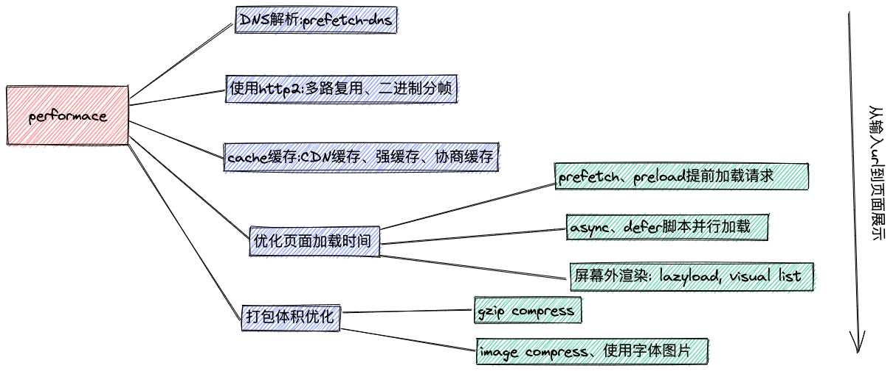

## 调试工具

### Network面板

1. 查看请求等待时间
2. DNS查询时间
3. TCP握手时间
4. SSL握手时间
5. 资源到达时间=TTFB-上面的查询建立时间
6. 资源加载时间

### lighthouse浏览器插件

提供FCP、TTI、SI、TBT、LCP、CLS的等指标

### Performance面板

各种资源的加载执行情况，内存的使用

## 缓存

1. 强缓存
Expires
Cache-Control

2. 协商缓存
Last-Modified If-Modified-Since
Etag If-None-Match

3. CDN缓存
浏览器本地缓存过期，不是直接请求源服务器，而是访问CDN边缘节点，如果边缘节点缓存也过期了，则会直接访问源服务器

## 压缩
Gzip压缩 `content-encoding: gzip`、`accept-encoding: gzip`

## 关键路径渲染

## 白屏时间、首屏时间

> 白屏时间就是从浏览器输入URL到页面展示第一个元素的时间。

> 首屏时间是指浏览器从响应用户输入网络地址，到首屏内容渲染完成的时间。

### preload prefetch preconnect dns-prefetch

preload 和 prefetch都是资源预获取，区别在于prefetch优先级较低，一般用于接下来可能会访问到的资源，而preload则是当前页面需要用到的资源。

注意MDN上preload兼容性比较差，Chrome和Edge都是部分支持，IE支持未知。

preconnect 指预先进行TCP握手链接，dns-prefetch则是预先进行DNS解析，注意dns-prefetch只适用于跨域请求的资源。

### async defer

### 屏幕外内容渲染

- 虚拟列表
- content-visibility 兼容性问题，不支持IE、Firefox、Safari

## 工程化

### Tree-Shaking

由于JavaScript是动态语言，只有在编译时才能确定代码的作用，因此在初期各种定义的模块规范都无法使用Tree-Shaking。后面出现了ES6的模块化，是一种静态的模块依赖，所以可以在代码运行前确认模块依赖关系，从而分析出来，哪些变量和函数没有用到，从而可以在打包压缩时去掉无用的代码。

不过由于代码中可能会包含一些副作用的代码，类似rollup和webpack无法进行静态分析，所以也会导致Tree-Shaking失效。
