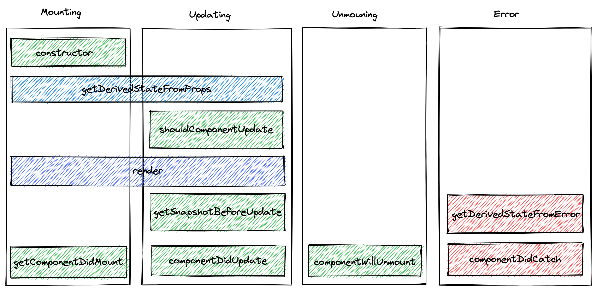
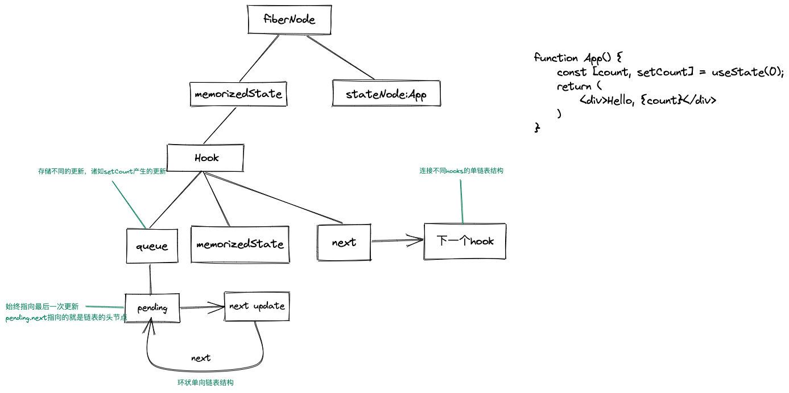
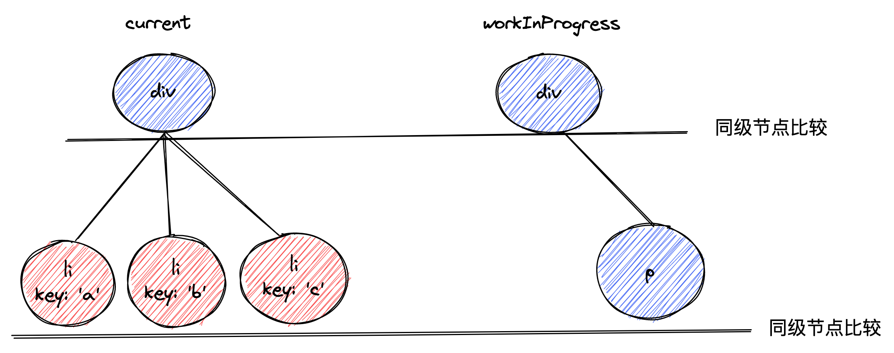

# React

## React 生命周期

## React Fiber

1. 把原有的递归更新架构改为可中断更新
2. DOM节点抽象成普通对象，称之为Vituial DOM，React中也可以叫做fiber
3. fiber就是一个时间切片，并且提供了任务优先级的调度

现在的架构分为三层
- Scheduler调度器，负责任务优先级的调度
- Reconciler协调器，找出fiber中变化的部分
- Renderer渲染器，将变化的部分渲染到页面上

> [React技术揭秘](https://react.iamkasong.com/preparation/newConstructure.html#react16%E6%9E%B6%E6%9E%84)

## Hooks原理

## diff算法

React 中的 diff 算法实际就是两颗树的diff，current 指针，指向了页面中的树，workInProgress 则指向了内存中更新的树。两颗树进行对比，需要`O^3`的时间复杂度，为了降低这个复杂度，React 做了一些进行 diff 的前置条件。

1. 只对同级的节点进行 diff，如果跨级的话，React 并不会复用节点
2. 不同类型的元素不会复用，只会销毁原来的元素及其子节点，新建新的节点
3. 可以通过 key 属性来暗示哪些元素是可以复用的。

同样根据更新后的节点的类型，diff 主要分为两种类型：

1. 单节点diff

单节点就是更新以后只有一个节点的情况，也会有以下几种情况

- 更新后的节点的类型和旧节点的类型不同，无法复用，删除旧节点，新建更新后的节点
- 更新后的节点类型和旧节点类型相同，key不同，无法复用，删除旧节点，新建新节点
- 更新后的节点类型和key都和旧节点相同，复用旧节点。旧节点如果还有剩余节点，则删除剩余节点及其子节点

2. 多节点diff

- 节点更新前后，数量相等，可能节点类型、属性发生变化
- 更新后的节点数量比更新前少，说明节点进行了删除
- 更新后的节点数量比更新前多，说明新增了节点
- 节点前后数量一致，类型属性一致，顺序发生了变化，这也是 diff 算法的核心

经过两轮遍历，第一轮找到更新的节点，第二轮则处理不是更新的节点，如位置、新增或者是删除。这里假设子节点有abcd四个节点，字母代表其 key 值，更新后的节点位置为dabc，根据参考位置索引 lastPlacedIndex 以及 新节点在旧节点的索引来决定是否需要移动。

## 性能优化

1. 优化加载性能

- 根元素添加 loading，使用prerender-spa-plugin，都是为了减少白屏时间
- 利用缓存、动态polyfill、代码分割、tree-shaking
- 看需要是否需要把代码编译到ES5，不需要的话，直接使用ES6+的代码，减少编译时间和代码体积
- 使用懒加载和骨架屏
