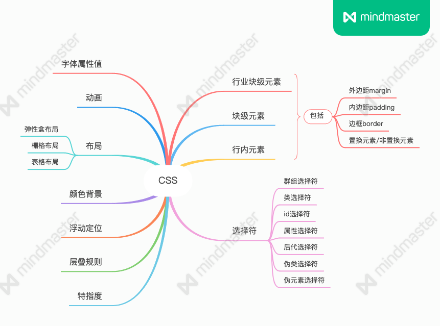

CSS其实远比我们想象的更复杂、他的任意一个点拿出来可能都可以写出一篇篇幅不小的文章，往往就能见微知著。所以CSS不仅仅局限于他的名字，层叠样式表，更像是一个世界，一个网页中必不可少的重要组成。

围绕着上面的CSS体系，当然上面的图可能还不够完全，但是也能说明CSS的主要构成了，我一一从左至右简单说下可能其中一些不知道的“隐藏属性”，先留下一个大体的印象，后续才能慢慢深入其中。

## 字体族
声明字体很简单，`font-famil`声明就完事了，但是有时我们可能会看到这样的声明：

```CSS
h1 {
  font-family: -apple-system,system-ui,Segoe UI,Roboto,Ubuntu,Cantarell,Noto Sans,sans-serif,BlinkMacSystemFont,Helvetica Neue,PingFang SC,Hiragino Sans GB,Microsoft YaHei,Arial;
}
```
这么一大串到底是几个意思呢，其实只要知道这个`font-faimly`属性中包含两种类型值就能明白了，一种是字体名称，一种叫做字体族。顾名思义，字体族就是所有字体的一个分类，在CSS世界中一般有以下几种字体族：

- 衬线字体。指的就是笔画开始、结束处有额外的装饰，并且笔画粗细不同。
- 无衬线字体。就是没有装饰，笔画粗细相同。
- 等宽字体。字形的宽度都相等。
- 草书字体。模仿人类手写的字体。
- 奇幻字体。没有归于以上四类字体的其他字体。

所以诸如上面的声明中的`sans-serif`、`Helvetica`指的是字体族，前者是衬线字体，后者是无衬线字体。那么这其中的意思就很明确了，如果系统中有前面的字体，那就使用前面的字体，如果没有的话，尝试使用后面的衬线字体，如果没有，则继续往后面的声明中寻找可用字体。

## 字重
像是`font-weight`这样的属性，在平时用100-900这样的数字属性值时，会发现好像字体粗细并没有变化，这是因为这些数字属性值实际上对应的是一些关键字lighter、bold、bolder。这取决于当前使用的字体。

我们知道字体可以利用`@font-face`来设置自定义的字体，其中就有`font-weight`属性，用来设置字重，而没有对应上的字重，则浏览器会自己设定当前这个字重值应该对应哪种，所以可能数字中的某几项对应的其实是一个字重。

## 继承
一般文本类的属性都是可以继承的，例如`color`，`font-size`，`font-family`等。

与之对应有些属性时不能继承的，例如`border`，`padding`，`margin`，`background`等。其实也很好理解这些属性为何不能继承，因为一旦这些属性可以继承，那么会影响到了整个布局，例如，我们在父元素上加个边框，但是其子元素，后代元素都继承了边框，那就不得不去写更多的代码来消除继承的影响，这样的结果肯定不是CSS设计的初衷。

## line-height
首先需要明确的是`line-height`是作用在行内元素或者是行内块级元素上的，经常可能会这么使用：

```CSS
div {
  line-height: 100px;
  font-size: 20px;
}
```
```HTML
<div>abc世界你好1</div>
```

于是看到了这样的效果：


可能下意识的就以为`line-height`就是作用在块级盒子上的。实际上呢，他是作用于块级盒子中的文本上的，如果去除 div 中的文本就会看到其宽度就没有 100px 了，文本也是行内元素，这点想必都是清楚的。

另外则是`line-height`的值可以为数值、百分比以及长度值，长度值也包括例如`em`这样的相对单位。当值不是具体长度值的时候，也就是为数值或者是百分比的时候，相对计算的是其`font-size`属性，如果`font-size`的值为`16px`，则`line-height: 1.5`的值就为`16 * 1.5`，就是`24px`，百分比值的时候也是这么计算的，不过需要注意的是，百分比值在继承的时候，会相对当前的`font-size`来计算，也就是说如果父子元素的`font-size`值不同，那么`line-height`计算出来的值也是不一样的。如果数值的话则没有这个问题，始终都是相对于数值来计算的。

## 盒模型
先来复习一下盒模型的概念，摘自MDN上的关于盒模型的定义

> 当对一个文档进行布局（lay out）的时候，浏览器的渲染引擎会根据标准之一的 CSS 基础框盒模型（CSS basic box model），将所有元素表示为一个个矩形的盒子（box）。CSS 决定这些盒子的大小、位置以及属性（例如颜色、背景、边框尺寸…）。

.png)

可以看到盒模型包含了这几部分：内容区、内边距、边框、外边距。根据这四个属性，分别出现了四种盒子：content box、padding box、border box以及margin box。但是对CSS比较了解的话就可以知道，其实并没有margin box盒子，原因在于margin指的是盒子的外边距，如论我们如何设置，都是不会影响盒子区域的大小，并且margin区域的背景也是始终透明的，因此这种盒子也就没有什么实际作用了。

先来说说内容区，他是我们展示内容的区域，默认情况下，设置的width/height其实就是作用在内容区上，当然如果要使其生效，display属性就不能为`inline`值。不过这在替换元素中表现又不一样。

先来看一个🌰

```css
.image {
  width: 300px;
  padding: 10px;
  margin: 10px;
  border: 1px solid blue;
}
```

```html

```


置换元素图片的默认display属性值是`inline`，但是却能设置宽高，并且padding值也是可以显示，这和我们理解的行内元素是完全不一样的。

## 3. 通用选择符的使用
所谓通用选择符，也可以称为通配符选择器，即

```css
* {
  box-sizing: border-box;
}
```
看起来非常的简单，但是滥用他会造成一些意向不到的结果。首页就是他会给所有的元素都添加上对应的属性，即使这个元素压根就用不到这个属性，这样就造成了一定的性能浪费，另外一点则是非常容易忽视的地方在于他的优先级，也是我们说的特指度，通用选择器的特指度为0，结合上面的继承来说，继承是没有特指度的，因此你如果用了通用选择符，然后指望元素通过继承获得父元素的继承属性，却会发现不起作用。来看个🌰

```css
* {
  color: grey;
}
div#page {
  color: black;
}
```
```html
<div id="page">
  我是CSS世界的小<em>菜鸡</em>
</div>
```


很明显，最终看到的`菜鸡`是绿色的。因此这也是非常容易让人困惑的地方。

## 4. CSS的全局关键字
全局关键字就是所有的属性都能使用的属性值，总共是有三个`inherit`，`initial`，`unset`。这些关键字是CSS3才出现的，在IE11以前和Opera Mini是不支持的。

inherit 就是打破了上面的继承限制，只要属性值设置为 inherit，那么就能从父元素继承这个属性。

initial 则是将属性设置为初始值，主要是用于那些没有预定义的初始值的属性，例如 color 属性，默认是取决于用户代理，就是用户设置的某个颜色值，而设置为 initial 则会将字体颜色变成黑色。

unset 则是前两个关键字的替代，就是对于继承的属性来说，unset 就表示 inherit，而对于不继承的属性则表示 initial。

还有一个特殊属性 all 就只支持这三个关键字。all 表示除了 direction 和 unicode-bidi 之外的所有的属性。因此如果设置了 all: inherit 则表示除了上述两个属性外，其他所有的CSS属性都从其父元素继承。

## 流体布局
> 见名思意，像水流一样的布局，当河流变窄，水流也会随之变窄，这就跟使用CSS布局也是同样的道理。
### margin: auto
### max-width/min-width
## white-space
## vertical-align